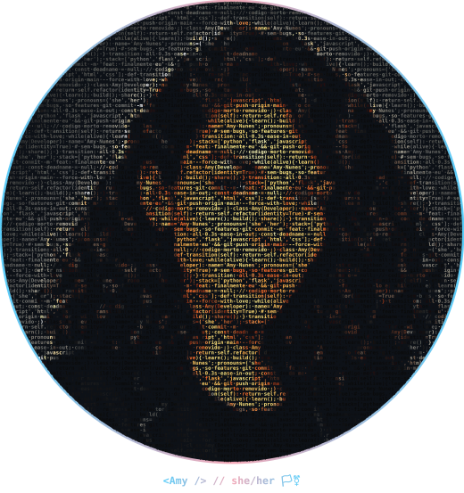

<!-- ═══════════════ HEADER ═══════════════ -->


<p align="center">
  
</p>

<p align="center">
  
  
  
  
</p>



```text

  .------------------------------.
 (  oii! que bom te ver aqui ♡  )
  '-.---------------------------'
   /
  /

  ~ agora mesmo ~

  > dev full-stack na Estek
  > criando o MChat e o MStock
  > integrando APIs e automatizando
  > convertendo doces em código 🍬

  > bora conversar? rola pra baixo ↓

```

<br clear="left" />

<br>

## 🌷 um pouquinho sobre mim

Oi! Eu sou a Amy, **desenvolvedora full-stack** há mais de 4 anos, com o coração no back-end em **Python**. Hoje trabalho na **Estek**, construindo o sistema que roda a operação inteira da empresa — do orçamento à expedição 📦 — e, nas horas vagas, cuido dos meus projetos autorais Sou formada em Engenharia de Controle e Automação, então automatizar coisas é meio que minha natureza 🤖

```python
class Amy(Desenvolvedora):
    def __init__(self):
        self.nome = "Amy Nunes"
        self.pronomes = ("she", "her")
        self.cargo = "Full-Stack @ Estek"
        self.coracao = ["back-end", "integrações", "I.A."]
        self.curiosidade = float("inf")

    def __str__(self):
        return "sempre pronta pro próximo desafio 🚀"
```

<br>

## 🗺️ minha jornada até aqui

| 📅 quando | 📍 onde | 💡 o que rola por lá |
|:--|:--|:--|
| 2023 – hoje | **Dev Full-Stack** @ Estek | ERP/MES multi-empresa com +15 integrações (marketplaces, pagamentos, transportadoras) |
| 2022 – 2023 | **Analista de TI** @ Estek | onde nasceram minhas primeiras apps web integradas ao ERP |
| 2017 – 2021 | **Eng. de Controle e Automação** @ UNIP | a origem da mania de automatizar tudo ✨ |

<br>

## 💖 projetos do coração

> ### 💬 MChat
> Plataforma SaaS de atendimento via **WhatsApp** e **Shopee Chat**, com inbox em tempo real, CRM e **agentes de I.A. com RAG** que fazem a triagem e passam a conversa pra um humano quando precisa.
>
> `FastAPI` · `React` · `PostgreSQL + pgvector` · `Redis` · `Celery` · `Docker`

> ### 📦 MStock
> Coletor de estoque em **PWA offline-first** para os tablets do galpão: bipagem, separação de pedidos e conferência funcionando **mesmo sem internet**. Quando o sinal volta, tudo sincroniza sem movimentar nada em dobro, integrado ao **Tiny ERP**, **Mercado Livre Full** e **Shopee**.
>
> `JavaScript` · `PWA` · `IndexedDB` · `Flask` · `MySQL` · `Celery` · `Docker`

<br>

## 🧰 minha caixinha de ferramentas

<table align="center">
  <tr>
    <td align="center" width="150"><br>🐍<br><b>back-end</b><br><br></td>
    <td>
      
      
      
      
      
    </td>
  </tr>
  <tr>
    <td align="center" width="150"><br>🗄️<br><b>dados</b><br><br></td>
    <td>
      
      
      
    </td>
  </tr>
  <tr>
    <td align="center" width="150"><br>🎨<br><b>front-end</b><br><br></td>
    <td>
      
      
      
      
      
    </td>
  </tr>
  <tr>
    <td align="center" width="150"><br>🤖<br><b>I.A. & automação</b><br><br></td>
    <td>
      
      
      
      
      
      
      
      
    </td>
  </tr>
  <tr>
    <td align="center" width="150"><br>🐳<br><b>devops</b><br><br></td>
    <td>
      
      
      
      
      
    </td>
  </tr>
</table>

<br>

## 📊 eu e o github: uma história de amor

<p align="center"><i>spoiler: eu apareço bastante por aqui ✨</i></p>

<p align="center">
  
</p>

<p align="center"><i>e aqui uma cobrinha comendo meus commits 🐍💕</i></p>

<p align="center">
  <picture>
    <source media="(prefers-color-scheme: dark)" srcset="./dist/snake-dark.svg" />
    
  </picture>
</p>

<p align="center"><sub>o mapa completinho das minhas contribuições fica logo abaixo deste README 👇</sub></p>

<br>

## 💌 vamos conversar?

<p align="center">Adoro trocar ideia sobre tecnologia, projetos e oportunidades. Escolhe o canal que combina com você:</p>

<table align="center">
  <tr>
    <td align="center" width="230">
      <br>💼<br><b>LinkedIn</b><br>
      <sub>pra falar de trabalho,<br>vagas e oportunidades</sub><br><br>
      <a href="https://www.linkedin.com/in/amynunes/"></a>
      <br><br>
    </td>
    <td align="center" width="230">
      <br>💌<br><b>E-mail</b><br>
      <sub>pra propostas, ideias<br>ou só um oi mesmo</sub><br><br>
      <a href="mailto:amynunes.c@gmail.com"></a>
      <br><br>
    </td>
    <td align="center" width="230">
      <br>📸<br><b>Instagram</b><br>
      <sub>pra acompanhar meu<br>dia a dia (e docinhos)</sub><br><br>
      <a href="https://www.instagram.com/amy.nup"></a>
      <br><br>
    </td>
  </tr>
</table>

<p align="center"><sub>⏱️ tempo médio de resposta: mais rápido que um hot reload</sub></p>

<br>

<p align="center">obrigada pela visita! volte sempre (｡•ᴗ•｡)♡</p>


